# 📄 Project Report: Docker Microservices Application and Virtual Machines

---

## Part 1: Running Multiple Docker Containers Using Docker Compose

### 📘 Обзор
Эта часть задачи направлена ​​на создание отдельных файлов Dockerfile для каждого микросервиса, создание образов Docker, развертывание приложения с помощью Docker Compose и обеспечение правильного взаимодействия всех сервисов. Целью было запустить тесты Postman для приложения и задокументировать результаты.

---

### Создаем Dockerfiles для Микросервисов

Для каждого микросервиса (`booking-service`, `gateway-service`, `payment-service` и т.д.), был создан индивидуальный Dockerfile. Ниже предоставлен пример для **hotel-service**:

```dockerfile
FROM maven:3.8.5-openjdk-8 AS build
WORKDIR /app
COPY pom.xml ./
RUN mvn dependency:go-offline
COPY src src
RUN mvn package -DskipTests
FROM openjdk:8-jdk-alpine
WORKDIR /app
COPY --from=build /app/target/*.jar app.jar
COPY wait-for-it.sh .
RUN chmod +x wait-for-it.sh
RUN apk add --no-cache bash
EXPOSE 8082
ENTRYPOINT ["./wait-for-it.sh", "db:5432", "--", "java", "-jar", "app.jar"]
```
### Создаем docker-compose файл, который обеспечивает корректное взаимодействие сервисов. 📷

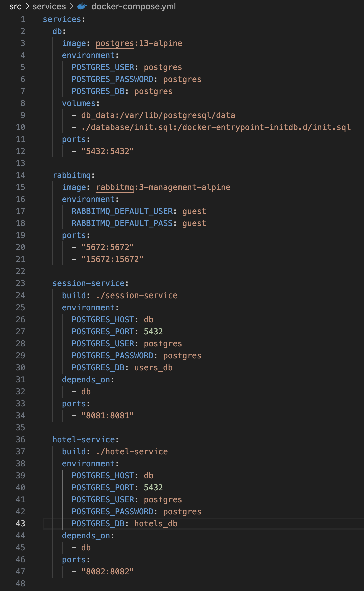

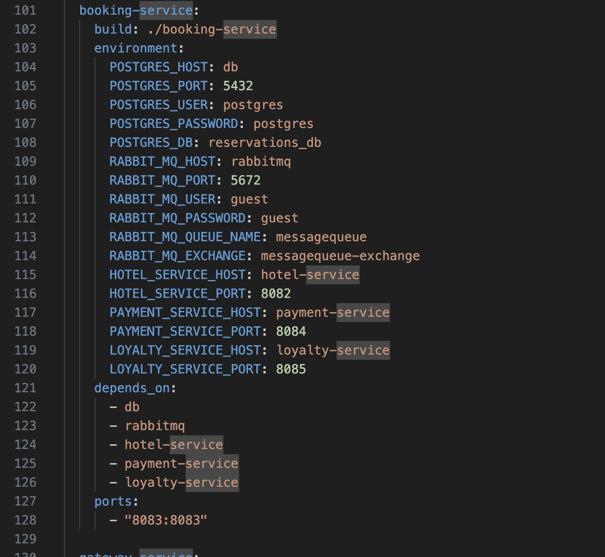
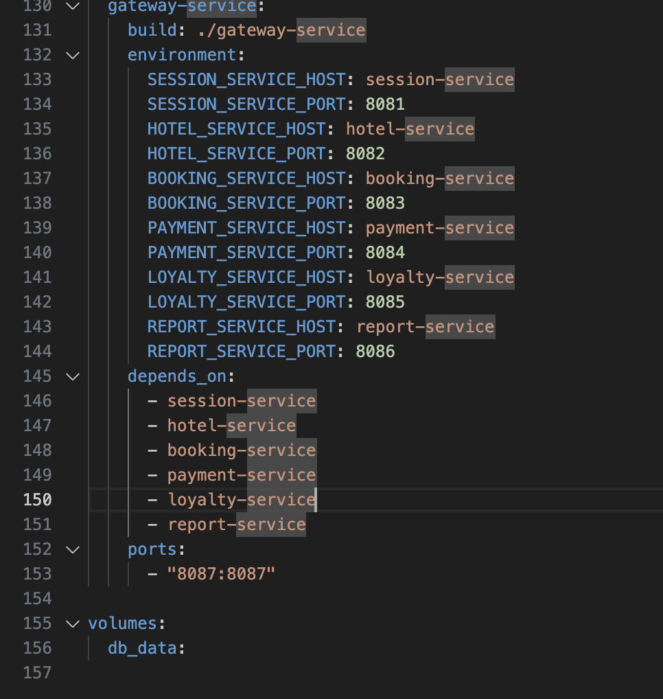

### Иницииализируем процесс сборки. Вывод показывает ход загрузки контекста, передачи файлов и получения зависимостей для каждого сервиса. 

<p align="center">
  
  
</p>

### Разворачиваем веб-сервис, используя файл Docker Compose, написанный на локальном компьютере. 📷

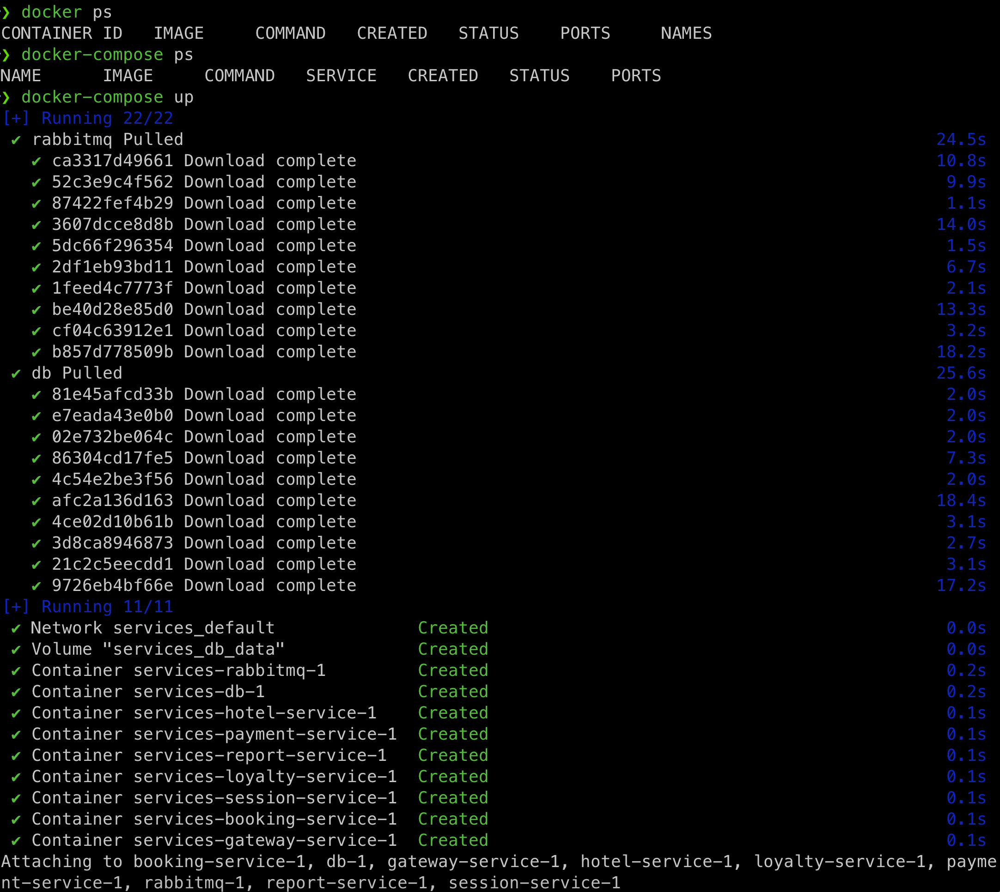

### Проверка работающих контейнеров

После развертывания сервисов с помощью Docker Compose крайне важно убедиться, что все контейнеры работают должным образом. 📷

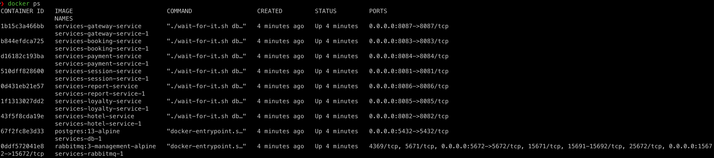

## Проверка состояния запущенных контейнеров и журналов

### Проверка работоспособности сервисов

Чтобы убедиться, что сервисы отвечают правильно, используем команды «curl» для запроса основных конечных точек. Ниже мы можем увидеть ответы нескольких микросервисов, работающих на разных портах:
- **Платежный сервис** (`localhost:8081`): предоставляет ссылки на управление пользователями, роли и конечные точки профилей.
- **Служба лояльности** (`localhost:8082`): предоставляет ссылки на информацию о стране, отеле и городе.
- **Служба сеансов** (`localhost:8083`): управляет конечными точками резервирования.

Это гарантирует, что службы работают правильно и доступны для внешних запросов.

### Проверка логов

На втором снимке экрана показаны журналы службы шлюза. Используя команду docker-compose logsgate-service, мы можем проверить процесс запуска службы шлюза. Вот ключевые детали из журналов:
- Служба инициализируется с помощью **Spring Boot**, а приложение работает на порту `8087`.
— Журналы подтверждают, что служба запущена и работает после успешного подключения к PostgreSQL и RabbitMQ.
- Кроме того, журналы показывают, что Spring Security инициализируется с профилями по умолчанию и обеспечивает безопасность службы.

На этих снимках экрана можно наблюдать за состоянием ответов службы и подробными журналами службы шлюза, подтверждающими, что службы доступны и работают правильно. 📷

<p align="center">
  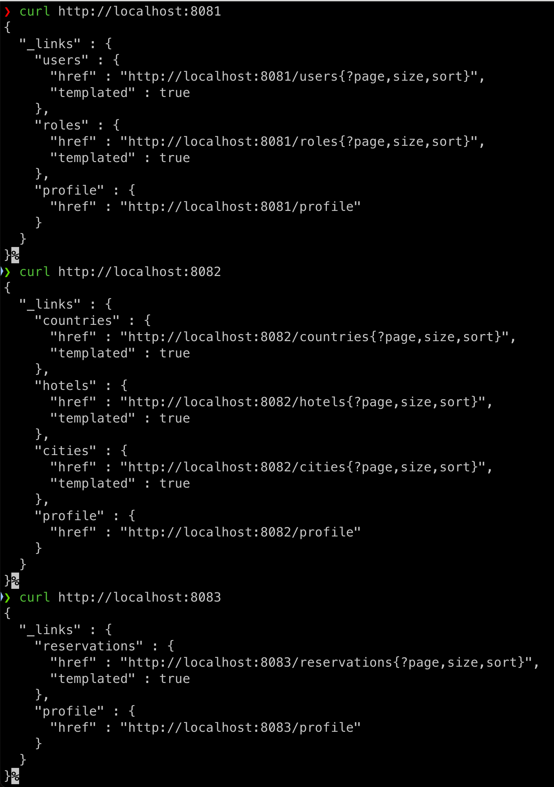
</p>

<p align="center">
  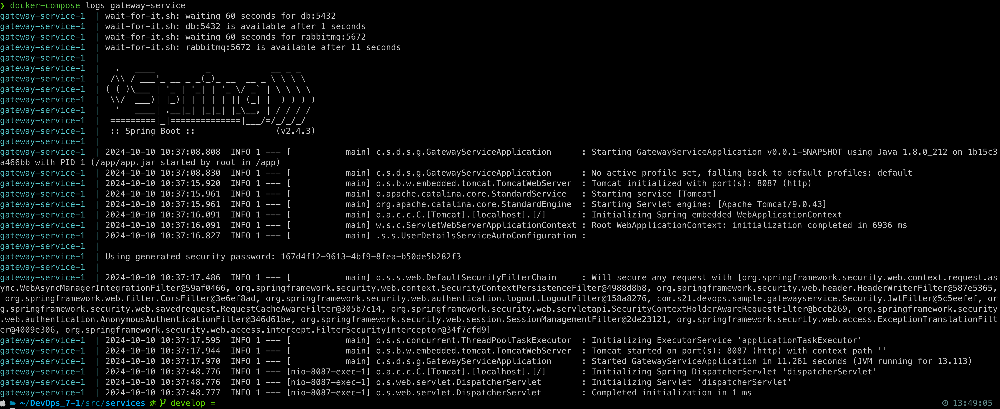
</p>

Так же можно проверить работу RabbitMQ через ```localhost:15672```

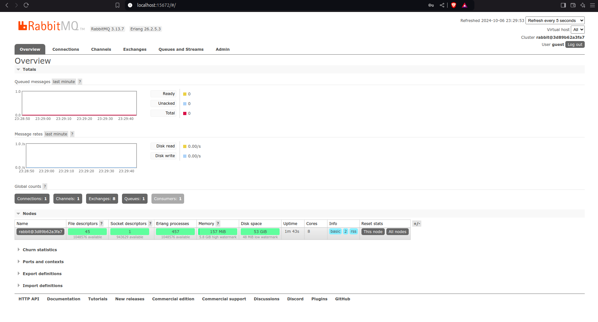

RabbitMQ — распределённый и горизонтально масштабируемый брокер сообщений. Упрощённо его устройство можно описать так:

паблишер, который отправляет сообщения;

очередь, где хранятся сообщения;

подписчики, которые выступают получателями сообщений.

RabbitMQ передаёт сообщения между поставщиками и подписчиками через очереди. Сообщения могут содержать любую информацию, например, о событии, произошедшем на сайте. 

### Узнаем размер контейнеров 📷

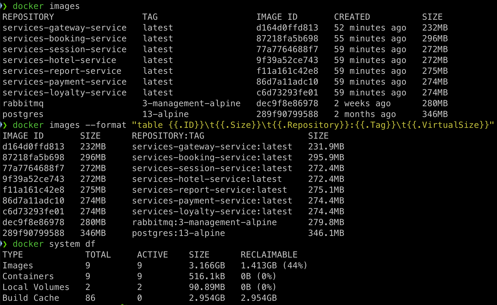

### Смотрим какие тесты есть в заготовленном json файле 📷

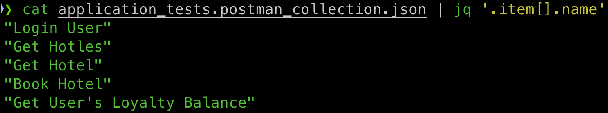

### Запускаем тесты в командной строке с помощью команды:

```bash 
newman run application_tests.postman_collection.json
```

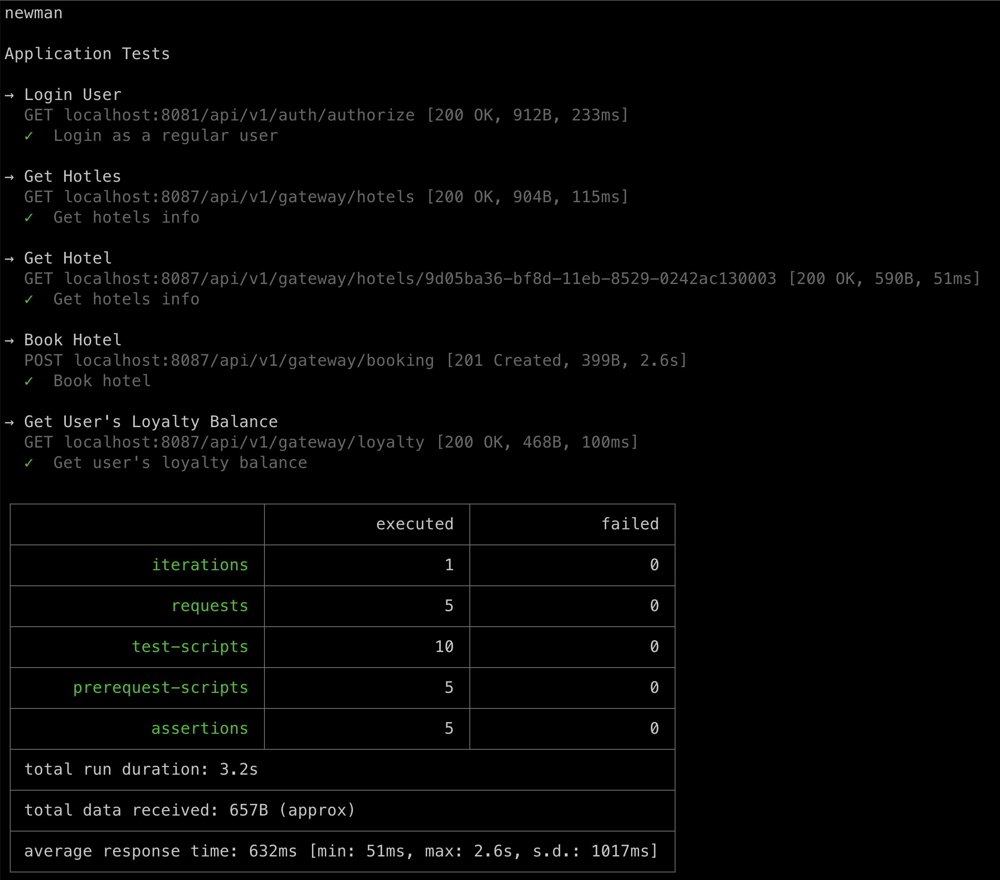

### Запускаем тесты в Postman

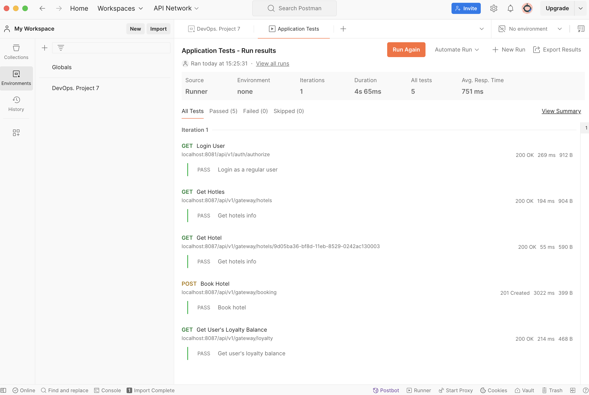

---

## Part 2: Creating Virtual Machines

### 📘 Обзор

Эта часть задачи включала настройку виртуальной машины (ВМ) с использованием Vagrant в качестве основы для будущих узлов Docker Swarm. Виртуальная машина была настроена с помощью Docker для оркестрации служб в кластере.

### В корневой папке проекта создаем Vagrantfile командой:

```bash
vagrant init
```

### Редактируем Vagrantfile для настройки виртуальной машины. Вот пример того, как можно написать Vagrantfile для создания базовой виртуальной машины с исходным кодом веб-сервиса внутри:

```Vagrantfile
Vagrant.configure("2") do |config|
  config.vm.box = "ubuntu/focal64"
  
  config.vm.hostname = "web-service-vm"

  config.vm.provider "virtualbox" do |vb|
    vb.memory = "1024"
    vb.cpus = 2
  end

  config.vm.synced_folder "./src", "/home/vagrant/src"

  config.vm.provision "shell", inline: <<-SHELL
    sudo apt-get update
    sudo apt-get install -y docker.io docker-compose
    sudo usermod -aG docker vagrant
  SHELL

  config.vm.network "private_network", type: "dhcp"
end
```

### Запускаем Vagrant командой:

```bash
vagrant up
```

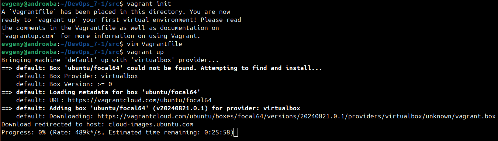

### После того, как машина будет запущена, можно получить к ней доступ с помощью:

```bash
vagrant ssh
```
Внутри виртуальной машины должен находиться исходный код в каталоге /home/vagrant/src:
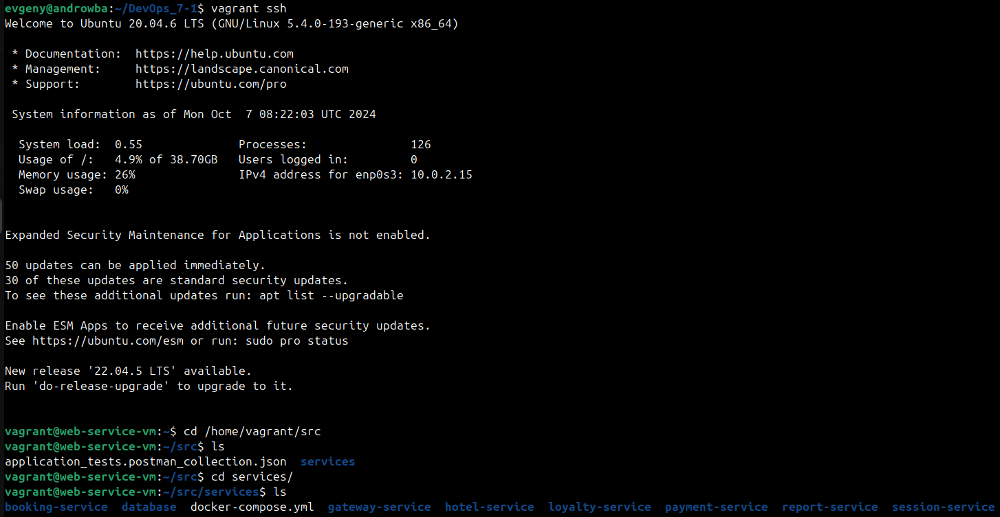

### Останавливаем и уничтожаем виртуальную машину
```bash
vagrant halt
vagrant destroy
```
Это полностью удалит виртуальную машину из системы

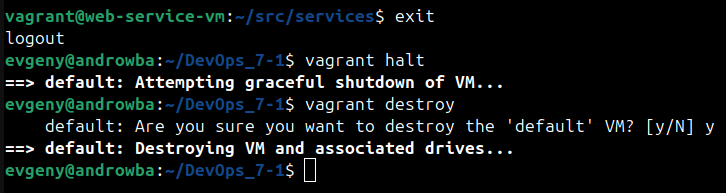

## Part 3: Creating a Simple Docker Swarm

📘 Обзор

В этой части мы настроили кластер Docker Swarm, используя три виртуальные машины, предоставленные с помощью Vagrant. Кластер состоит из одного управляющего узла и двух рабочих узлов. Затем мы развернули наше приложение микросервисов с помощью Docker Swarm и настроили прокси-сервер Nginx для доступа к сервисам через оверлейную сеть.

### Изменяем Vagrantfile, чтобы создать три машины: manager01, worker01, worker02:

```Vagrantfile
Vagrant.configure("2") do |config|
  config.vm.box = "ubuntu/bionic64"

  config.vm.define "manager01" do |manager|
    manager.vm.hostname = "manager01"
    manager.vm.network "private_network", ip: "192.168.56.10"
    manager.vm.network "forwarded_port", guest: 80, host: 8080, host_ip: "127.0.0.1"
    manager.vm.network "forwarded_port", guest: 9000, host: 9000, host_ip: "0.0.0.0"
    manager.vm.provision "shell", path: "scripts/install_docker.sh"
    manager.vm.provision "shell", path: "scripts/init_swarm.sh", privileged: false
  end

  ["worker01", "worker02"].each_with_index do |name, index|
    config.vm.define name do |worker|
      worker.vm.hostname = name
      worker.vm.network "private_network", ip: "192.168.56.1#{index + 1}"
      worker.vm.provision "shell", path: "scripts/install_docker.sh"
      worker.vm.provision "shell", path: "scripts/join_swarm.sh", privileged: true
    end
  end
end
```

### Пишем скрипты оболочки для установки Docker внутри машин, инициализации и подключения к Docker Swarm.

```install_docker.sh``` Этот скрипт установит Docker на каждую виртуальную машину.

```bash
#!/bin/bash

# Обновляем и устанавливаем необходимые пакеты
sudo apt-get update
sudo apt-get install -y apt-transport-https ca-certificates curl software-properties-common

# Добавляем официальный GPG ключ Docker'a
curl -fsSL https://download.docker.com/linux/ubuntu/gpg | sudo apt-key add -

# Настраиваем стабильный репозиторий
sudo add-apt-repository \
    "deb [arch=amd64] https://download.docker.com/linux/ubuntu $(lsb_release -cs) stable"

# Устанавливаем Docker
sudo apt-get update
sudo apt-get install -y docker-ce

# Включаем Docker для запуска при загрузке
sudo systemctl enable docker
sudo systemctl start docker
```

```init_swarm.sh``` Этот скрипт инициализирует Docker Swarm на менеджере node

```bash
#!/bin/bash

# Инициализируем Docker Swarm на менеджере
sudo docker swarm init --advertise-addr $(hostname -I | awk '{print $2}')

# Вывод команды join для рабочих
sudo docker swarm join-token worker | grep docker > /vagrant/scripts/join_command.sh
```

после запуска этого скрипта мы получаем готовый файл. Рабочие ноды могут выполнить эту команду, чтобы присоединиться к Swarm, управляемому manager01. 
```bash
docker swarm join --token SWMTKN-1-3zof5x7jltcu0lae480z2427phtk9xa0i1nypv42c7ierce6lv-d1xhmbo5gg349mrlcc91700l1 192.168.56.10:2377
```

```join_swarm.sh``` Этот скрипт позволит рабочим нодам присоединяться к Docker Swarm, используя токен присоединения от управляющего узла.

```bash
#!/bin/bash 

# Присоединяемся к Docker Swarm в качестве рабочего
bash /vagrant/scripts/join_command.sh
```

### Поднимаем 3 машины(менеджера и двоих рабочих)

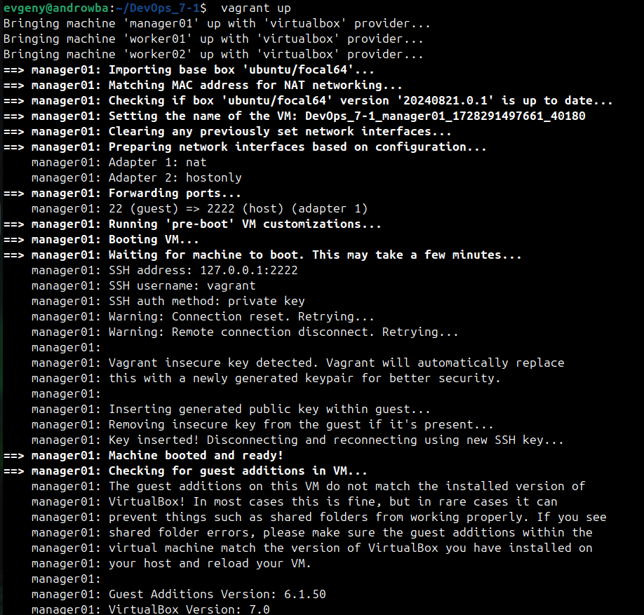

### Подключаемся к менеджеру через ssh и проверяем статус Docker Swarm командой:

```bash
sudo docker node ls
```

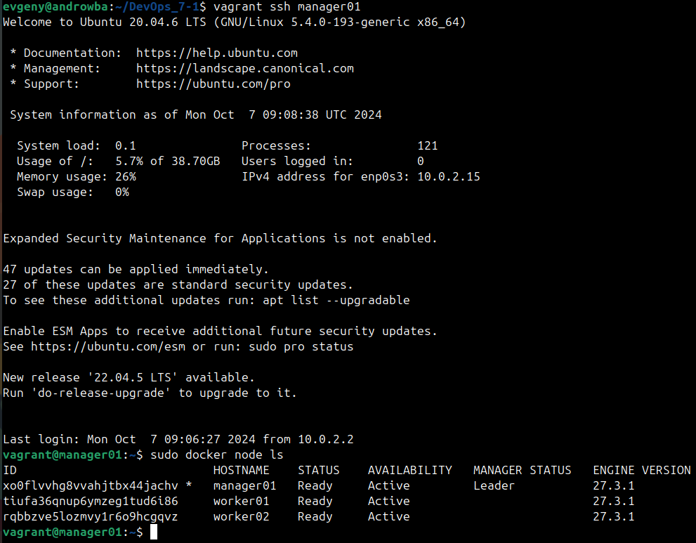

### Логинимся в Докере с помощью команды:
```bash
docker login
```

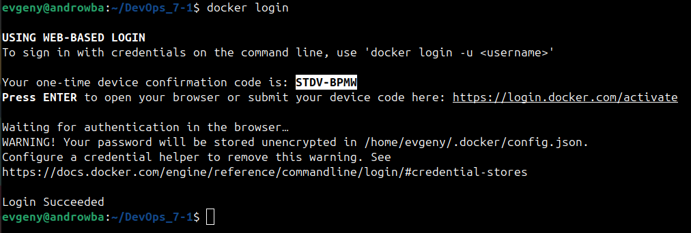

#### вводим код подтверждения в браузере

<p align="center">
  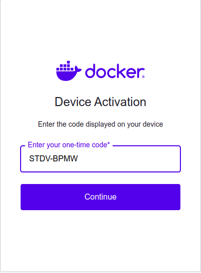
  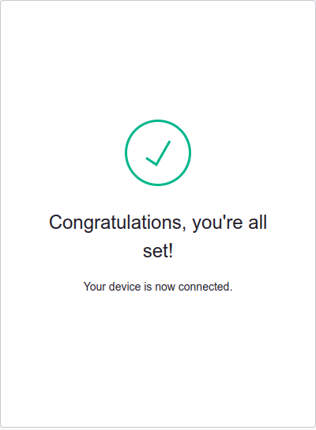
</p>

### Чтобы загрузить созданные образы Docker в Docker Hub выполняем следующие действия:
   Помечаем и пушим образы Docker в Docker Hub

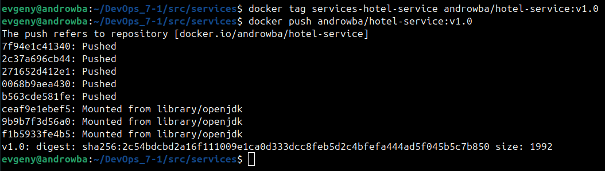

Проверяем репозиторий в Docker Hub

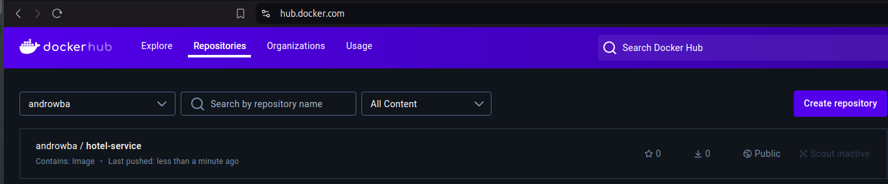

Выполняем эти действия для каждого сервиса

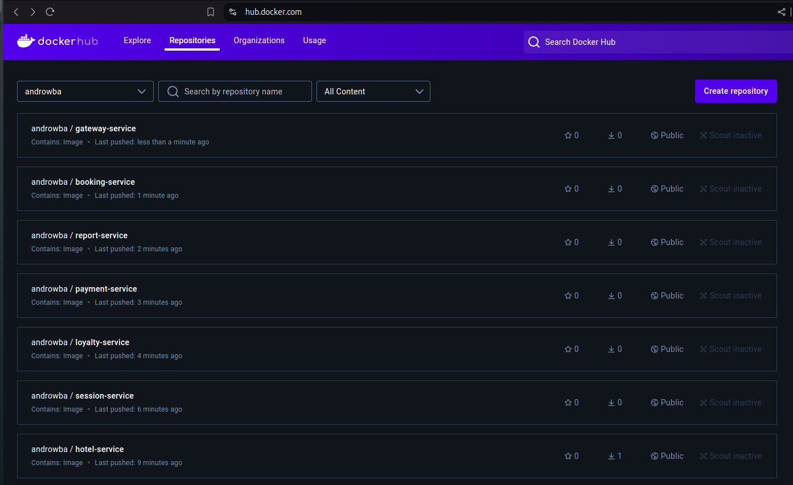

Изменяем docker-compose файл чтобы использовать образ, который мы отправили в Docker Hub, а не собирать его локально.
А именно изменяем строку ```build:``` на строку  ```image:```, которая указывает на образ Docker Hub.

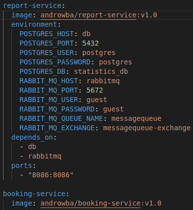

### Повторное развертывание с обновленной конфигурацией

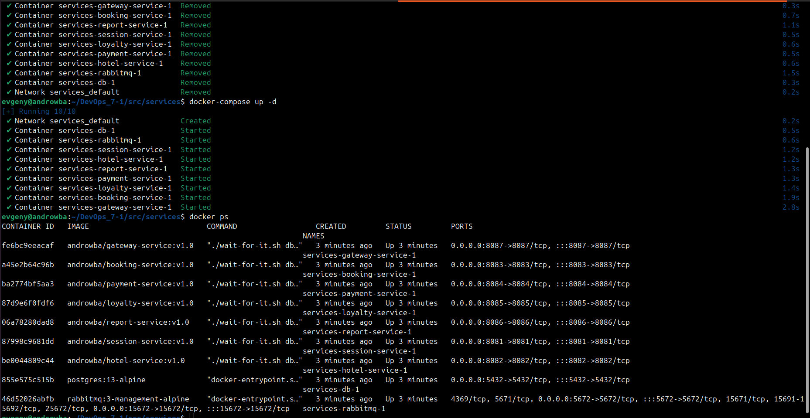

### Подключаемся к виртуальной машине и еще раз убеждаемся что настройки Vagrant для управляющего и рабочего нодов запущены и работают

Поднимаем виртуалку:
```bash
vagrant up
```

Подключаемся по SSH к управляющему ноду:
```bash
vagrant ssh manager01
```

Оказавшись внутри менеджера, убеждаемся, что Docker Swarm запущен:
```bash
sudo docker node ls
```

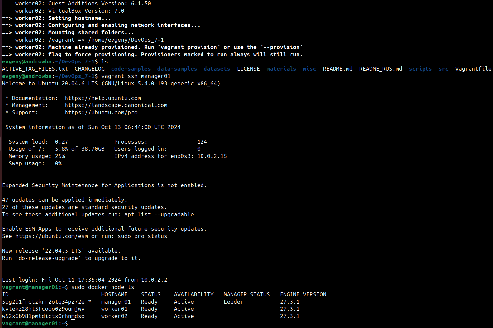

### Перемещаем docker-compose.yml в Manager

Теперь нам нужно скопировать файл docker-compose.yml в менеджер.

Выходим из менеджера и переходим в терминал хост-машины.

Можно настроить более явную команду scp, используя сведения о конфигурации из Vagrant:

```bash
vagrant ssh-config manager01
```
Эта команда выведет нам нужные данные для копирования 

Используем vagrant scp c полученными данными, чтобы перенести файл docker-compose.yml в узел менеджера:

Пример использования scp:

```bash
scp -i /home/evgeny/DevOps_7-1/.vagrant/machines/manager01/virtualbox/private_key -P 2206 src/services/docker-compose.yml vagrant@127.0.0.1:/home/vagrant/docker-compose.yml
```
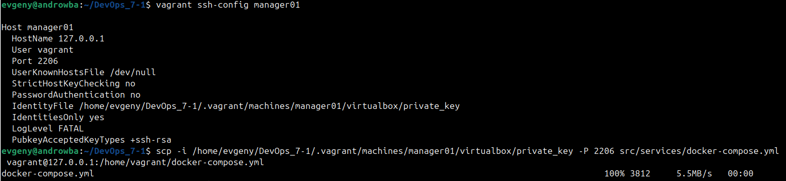

Проверяем что все скопировалось успешно и файл не пустой

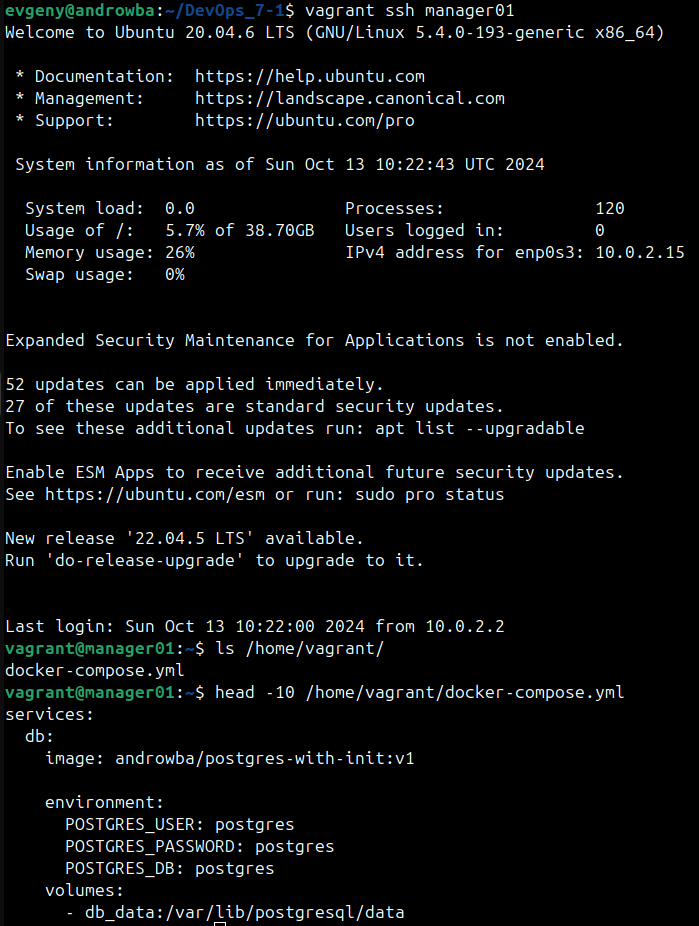

Так же создаем папку для скрипта который создает базы данных и копируем его туда с локальной машины

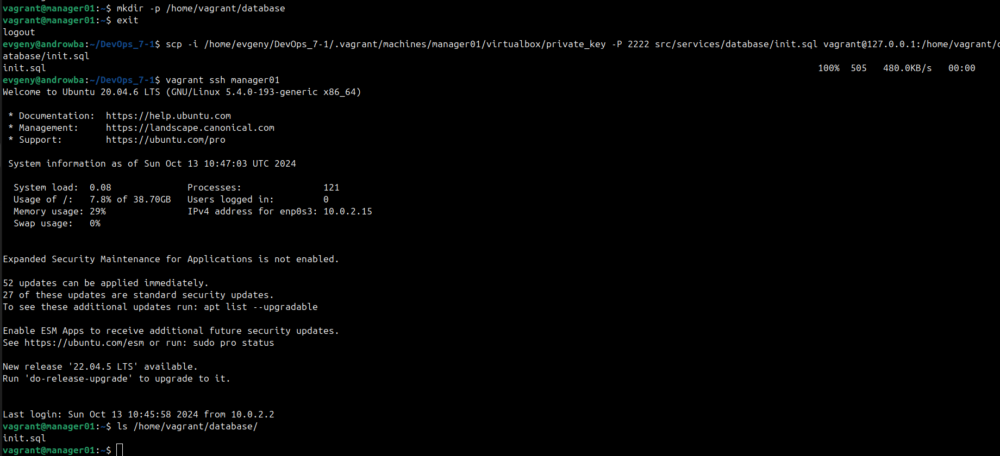

### Запускаем service stack, используя скопированный файл docker-compose.

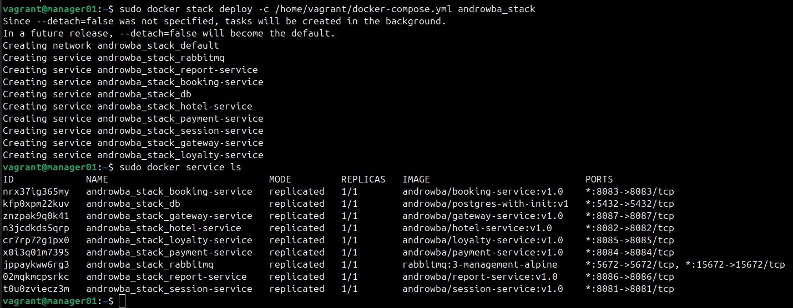

создаем папку и конфигурационный файл

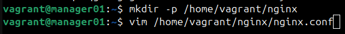

со следующими кофигурациями:
```yml
worker_processes  1;

events {
    worker_connections  1024;
}

http {
    upstream gateway_service {
        server gateway-service:8087;
    }

    upstream session_service {
        server session-service:8081;
    }

    server {
        listen 80;

        location /api/v1/auth/ {
            proxy_pass http://session_service;
            proxy_set_header Host $host;
        }

        location / {
            proxy_pass http://gateway_service;
            proxy_set_header Host $host;
        }
    }
}
```

Так же мы удалили внешнее сопоставление портов (например, "8081:8081"). Это гарантирует, что сервисы будут доступны только в пределах сети Docker overlay и не будут напрямую открыты для хост-машины. Прокси-сервер Nginx будет обрабатывать маршрутизацию к этим сервисам внутренне.

```yml
version: '3.8'

services:
  db:
    image: androwba/postgres-with-init:v1
    environment:
      POSTGRES_USER: postgres
      POSTGRES_PASSWORD: postgres
      POSTGRES_DB: postgres
    volumes:
      - db_data:/var/lib/postgresql/data
    configs:
      - source: init_sql
        target: /docker-entrypoint-initdb.d/init.sql
    networks:
      - backend

  rabbitmq:
    image: rabbitmq:3-management-alpine
    environment:
      RABBITMQ_DEFAULT_USER: guest
      RABBITMQ_DEFAULT_PASS: guest
    networks:
      - backend

  session-service:
    image: androwba/session-service:v1.0
    environment:
      POSTGRES_HOST: db
      POSTGRES_PORT: 5432
      POSTGRES_USER: postgres
      POSTGRES_PASSWORD: postgres
      POSTGRES_DB: users_db
    depends_on:
      - db
    networks:
      - backend

  hotel-service:
    image: androwba/hotel-service:v1.0
    environment:
      POSTGRES_HOST: db
      POSTGRES_PORT: 5432
      POSTGRES_USER: postgres
      POSTGRES_PASSWORD: postgres
      POSTGRES_DB: hotels_db
    depends_on:
      - db
    networks:
      - backend

  payment-service:
    image: androwba/payment-service:v1.0
    environment:
      POSTGRES_HOST: db
      POSTGRES_PORT: 5432
      POSTGRES_USER: postgres
      POSTGRES_PASSWORD: postgres
      POSTGRES_DB: payments_db
      RABBIT_MQ_HOST: rabbitmq
      RABBIT_MQ_PORT: 5672
    depends_on:
      - db
      - rabbitmq
    networks:
      - backend

  loyalty-service:
    image: androwba/loyalty-service:v1.0
    environment:
      POSTGRES_HOST: db
      POSTGRES_PORT: 5432
      POSTGRES_USER: postgres
      POSTGRES_PASSWORD: postgres
      POSTGRES_DB: balances_db
      RABBIT_MQ_HOST: rabbitmq
      RABBIT_MQ_PORT: 5672
    depends_on:
      - db
      - rabbitmq
    networks:
      - backend

  report-service:
    image: androwba/report-service:v1.0
    environment:
      POSTGRES_HOST: db
      POSTGRES_PORT: 5432
      POSTGRES_USER: postgres
      POSTGRES_PASSWORD: postgres
      POSTGRES_DB: statistics_db
      RABBIT_MQ_HOST: rabbitmq
      RABBIT_MQ_PORT: 5672
      RABBIT_MQ_USER: guest
      RABBIT_MQ_PASSWORD: guest
      RABBIT_MQ_QUEUE_NAME: messagequeue
      RABBIT_MQ_EXCHANGE: messagequeue-exchange
    depends_on:
      - db
      - rabbitmq
    networks:
      - backend

  booking-service:
    image: androwba/booking-service:v1.0
    environment:
      POSTGRES_HOST: db
      POSTGRES_PORT: 5432
      POSTGRES_USER: postgres
      POSTGRES_PASSWORD: postgres
      POSTGRES_DB: reservations_db
      RABBIT_MQ_HOST: rabbitmq
      RABBIT_MQ_PORT: 5672
      RABBIT_MQ_USER: guest
      RABBIT_MQ_PASSWORD: guest
      RABBIT_MQ_QUEUE_NAME: messagequeue
      RABBIT_MQ_EXCHANGE: messagequeue-exchange
      HOTEL_SERVICE_HOST: hotel-service
      HOTEL_SERVICE_PORT: 8082
      PAYMENT_SERVICE_HOST: payment-service
      PAYMENT_SERVICE_PORT: 8084
      LOYALTY_SERVICE_HOST: loyalty-service
      LOYALTY_SERVICE_PORT: 8085
    depends_on:
      - db
      - rabbitmq
      - hotel-service
      - payment-service
      - loyalty-service
    networks:
      - backend

  gateway-service:
    image: androwba/gateway-service:v1.0
    environment:
      SESSION_SERVICE_HOST: session-service
      SESSION_SERVICE_PORT: 8081
      HOTEL_SERVICE_HOST: hotel-service
      HOTEL_SERVICE_PORT: 8082
      BOOKING_SERVICE_HOST: booking-service
      BOOKING_SERVICE_PORT: 8083
      PAYMENT_SERVICE_HOST: payment-service
      PAYMENT_SERVICE_PORT: 8084
      LOYALTY_SERVICE_HOST: loyalty-service
      LOYALTY_SERVICE_PORT: 8085
      REPORT_SERVICE_HOST: report-service
      REPORT_SERVICE_PORT: 8086
    depends_on:
      - session-service
      - hotel-service
      - booking-service
      - payment-service
      - loyalty-service
      - report-service
    networks:
      - backend

  nginx:
    image: nginx:latest
    ports:
      - "80:80"
    configs:
      - source: nginx_conf
        target: /etc/nginx/nginx.conf
    depends_on:
      - gateway-service
      - session-service
    networks:
      - backend

networks:
  backend:
    driver: overlay

volumes:
  db_data:

configs:
  nginx_conf:
    file: ./nginx/nginx.conf
  init_sql:
    file: ./database/init.sql
```

 Нужно создать proxy_network. Эта сеть позволит осуществлять связь между прокси Nginx и сервисами сеанса/шлюза.

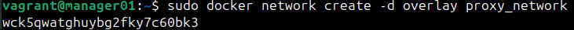

Тестируем оверлейную сеть в постман предварительно изменив порт на 80й

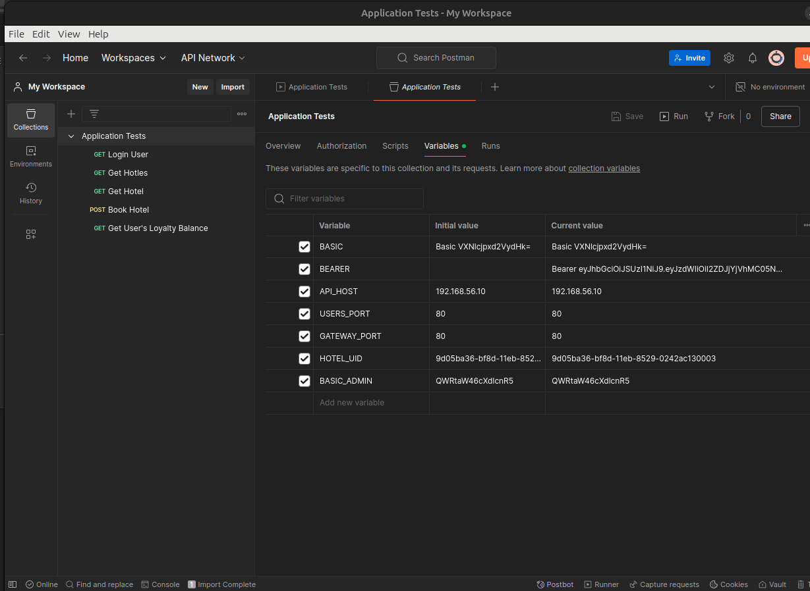

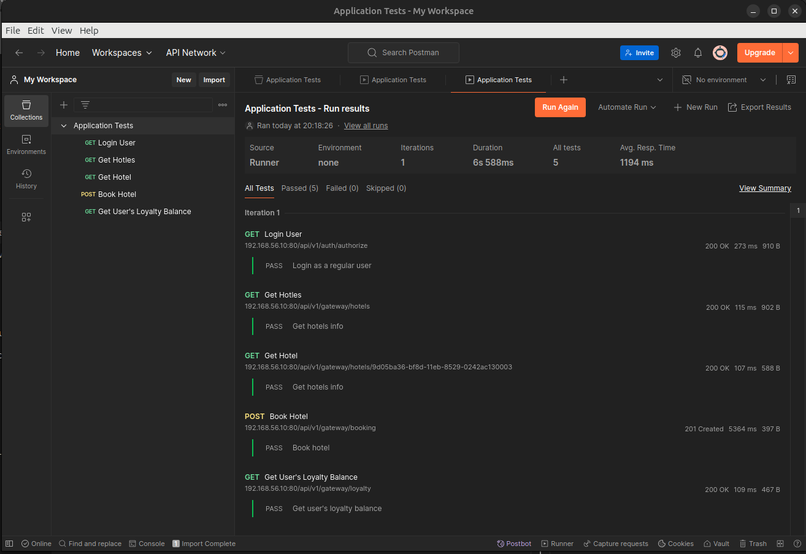

### Используя команды docker, можно посмотреть распределение контейнеров по нодам.

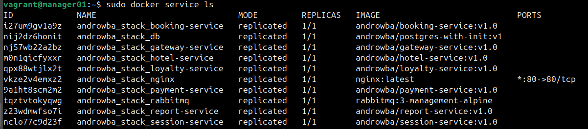

### Вручную нужно проверять ID каждого сервиса

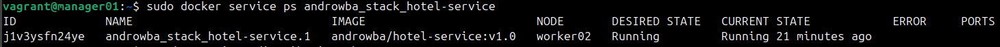

### Можно написать скрипт который соберет всю информацию и выведет все сразу

```bash
echo "Service Distribution by Nodes" > container_distribution_report.txt
echo "=============================" >> container_distribution_report.txt

for service in $(sudo docker service ls --format '{{.Name}}'); do
    echo "Service: $service" >> container_distribution_report.txt
    sudo docker service ps $service --format 'Task={{.ID}} Node={{.Node}}' >> container_distribution_report.txt
    echo "-----------------------------" >> container_distribution_report.txt
done

echo "Report generated: container_distribution_report.txt"
```

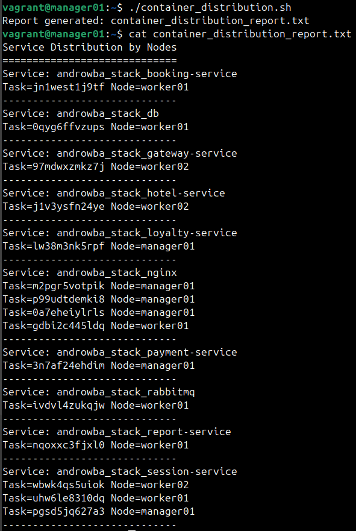

### Устанавливаем отдельный стек Portainer внутри кластера.

 Добавляем конфигурации сервиса в ```docker-compose.yml``` 
Это позволяет нам получить доступ к веб-интерфейсу Portainer по адресу http://<localhost>:9000 из хост-системы.

```docker-compose
portainer:
    image: portainer/portainer-ce
    ports:
      - "9000:9000"
    volumes:
      - /var/run/docker.sock:/var/run/docker.sock
      - portainer_data:/data
    networks:
      - backend
    deploy:
      placement:
        constraints: [node.role == manager]
```

Cоздаем портейнер сервис и проверяем что все работает

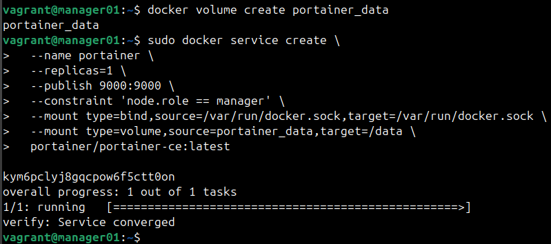

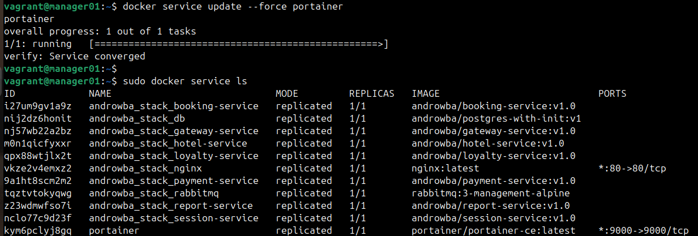

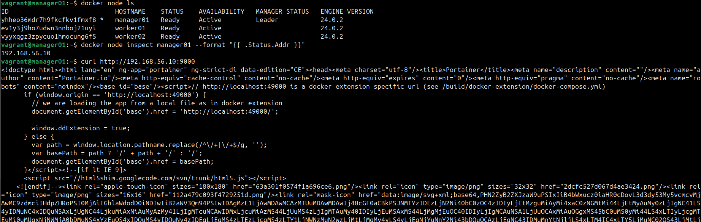

### С помощью Portainer можно посмотреть визуализацию распределения задач по нодам

Подключаемся в браузере через порт 9000

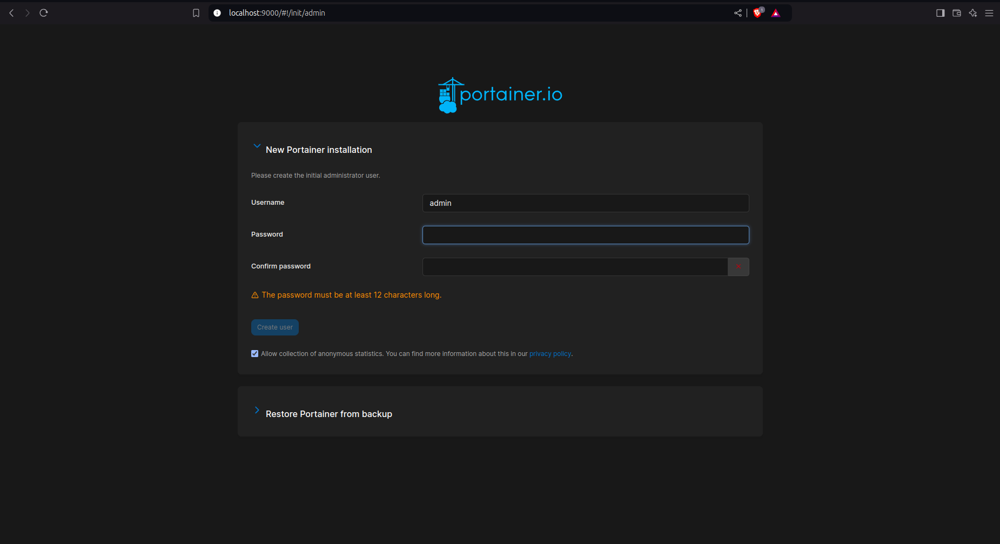

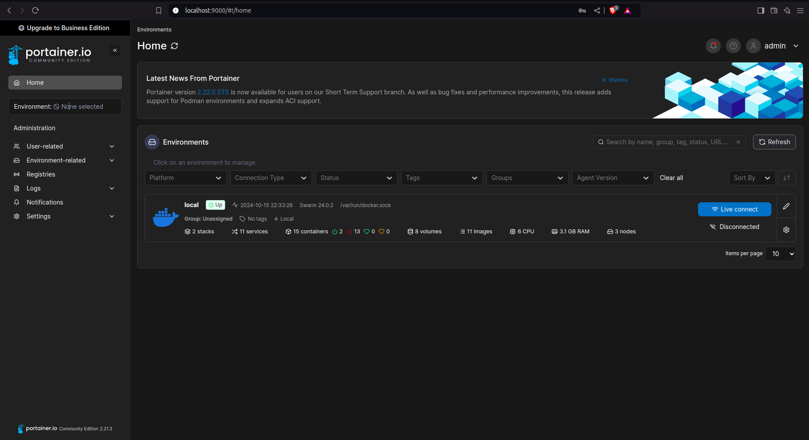

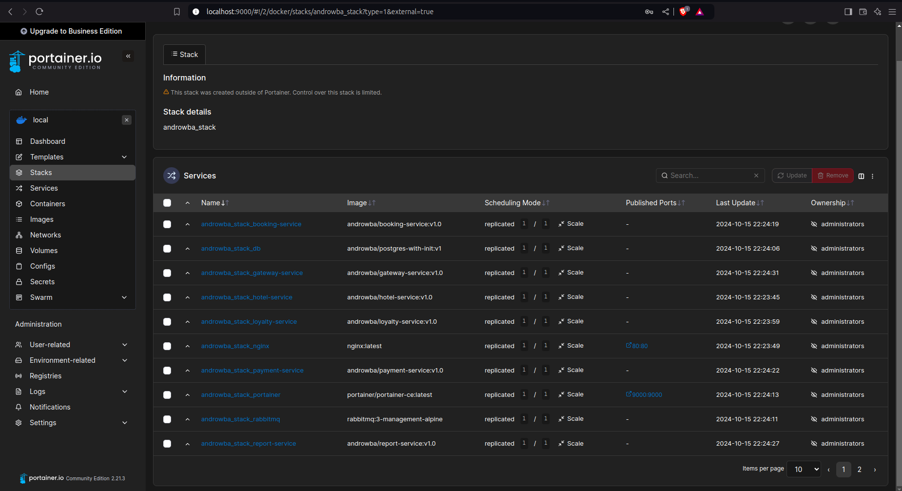

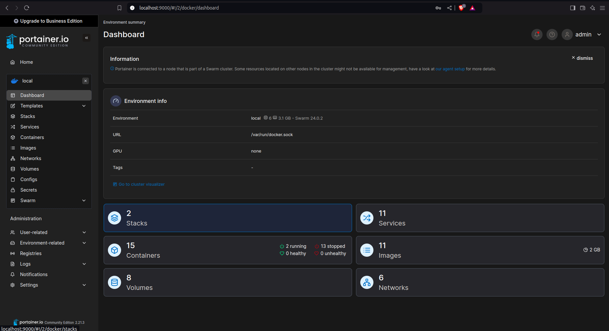
